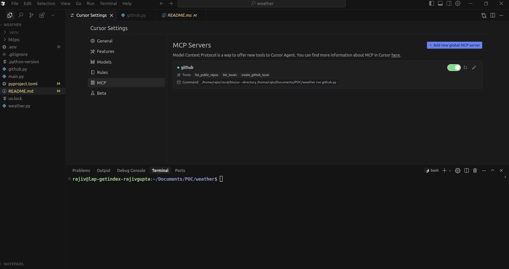

# Weather/GitHub MCP Server

This project provides a GitHub MCP server with tools to interact with GitHub repositories and issues.

## Requirements
- Python 3.10 or newer
- [uv](https://github.com/astral-sh/uv) (a fast Python package/dependency manager)
- A GitHub personal access token (for creating issues)

## Setup & Usage

1. **Clone this repository and install dependencies using uv:**

```sh
uv init mcp-server-demo
cd mcp-server-demo
uv run ../github.py
```

Or, if you are already in the project directory:

```sh
uv run github.py
```

2. **Set your GitHub token:**

Create a `.env` file in the project root with:

```
GITHUB_TOKEN=your_personal_access_token_here
```

Or export it in your shell:

```sh
export GITHUB_TOKEN=your_personal_access_token_here
```

## Features
- List public repositories for a GitHub user
- List issues for a repository
- Create issues in a repository

## Notes
- Make sure your token has the correct permissions for repository and issue access.
- The server runs using the MCP protocol with FastMCP.

## Configuring MCP Servers

To make your MCP server available in Cursor, configure it in your `~/.cursor/mcp.json` file. Example configuration:

```json
{
  "mcpServers": {
    "github": {
      "command": "uv",
      "args": [
        "--directory",
        "/ABSOLUTE/PATH/TO/PARENT/FOLDER/github-mcp-demo",
        "run",
        "github.py"
      ]
    }
  }
}
```

This tells Cursor how to start your MCP server and what command to use.

### Example: Cursor Settings UI

Below is a screenshot showing the MCP server available in Cursor:


### MCP Server Status in Cursor

Cursor shows your configured MCP servers in the curso settings UI, indicating whether each server is ON (enabled) or OFF (disabled). This helps you quickly see which tools are available.

Add your screenshot below to illustrate this:


